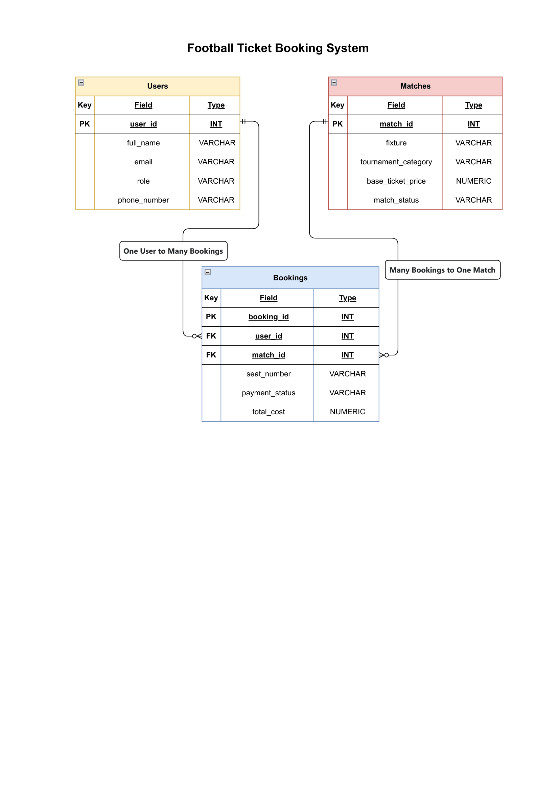

# ⚽ Football Ticket Booking System – Database Design & SQL Queries

## 📌 Overview

This project is a **PostgreSQL Database Design and SQL Queries** assignment for a **Football Ticket Booking System**. It demonstrates database normalization, table relationships, ERD design, and SQL query writing using PostgreSQL.

The system allows football fans to purchase match tickets while administrators manage users, matches, and bookings.

---

# 🎯 Objectives

This project demonstrates the ability to:

- Design a relational database using an Entity Relationship Diagram (ERD)
- Implement Primary Keys and Foreign Keys
- Maintain Referential Integrity
- Build relationships:
  - One-to-One (Logical)
  - One-to-Many
  - Many-to-One
- Write SQL queries using:
  - JOINs
  - Subqueries
  - Aggregate Functions
  - Pattern Matching
  - NULL Handling
  - Pagination
  - Sorting & Filtering

---

# 📂 Database Schema

The database contains **3 tables**.

## 1. Users

Stores all registered users including football fans and administrators.

| Column | Description |
|----------|-------------|
| user_id | Unique user ID (Primary Key) |
| full_name | Full name of the user |
| email | Email address |
| role | Ticket Manager or Football Fan |
| phone_number | Contact number |

---

## 2. Matches

Stores football tournament matches.

| Column | Description |
|----------|-------------|
| match_id | Unique match ID (Primary Key) |
| fixture | Competing teams |
| tournament_category | League or Cup name |
| base_ticket_price | Standard ticket price |
| match_status | Available / Selling Fast / Sold Out / Postponed |

---

## 3. Bookings

Stores every ticket purchase.

| Column | Description |
|----------|-------------|
| booking_id | Unique booking ID (Primary Key) |
| user_id | References Users table |
| match_id | References Matches table |
| seat_number | Reserved stadium seat |
| payment_status | Pending / Confirmed / Cancelled / Refunded |
| total_cost | Final booking amount |

---

# 🔗 Relationships

### One-to-Many

One **User** can make many **Bookings**.

```
Users (1)
      │
      │
      ▼
Bookings (Many)
```

---

### Many-to-One

Many **Bookings** can belong to one **Match**.

```
Bookings (Many)
      │
      │
      ▼
Matches (1)
```

---

### One-to-One (Logical)

Each booking represents exactly:

- One User
- One Match
- One Seat

Each booking record uniquely connects a user with a specific match and reserved seat.

---

# 🗺️ Entity Relationship Diagram (ERD)

> Add your ERD image below after creating it.

```
Users
------
PK user_id
full_name
email
role
phone_number
      │
      │ 1
      │
      ▼
Bookings
---------
PK booking_id
FK user_id
FK match_id
seat_number
payment_status
total_cost
      ▲
      │
      │ Many
      │
Matches
--------
PK match_id
fixture
tournament_category
base_ticket_price
match_status
```

Replace this section with your ERD image.

Example:

```
ERD.png
```

or

```markdown

```

---

# 💼 Business Logic

The Football Ticket Booking System supports the following workflow:

- Users register on the platform.
- Administrators manage football matches.
- Football fans browse available matches.
- Fans purchase tickets by creating bookings.
- Each booking stores seat information and payment status.
- Multiple fans can book tickets for the same match.
- One fan can purchase tickets for multiple matches.

---

# 🛠 Technologies Used

- PostgreSQL
- SQL
- pgAdmin 4

---

# 📚 SQL Topics Covered

This project includes practice with:

- CREATE DATABASE
- CREATE TABLE
- INSERT INTO
- SELECT
- WHERE
- ORDER BY
- LIMIT
- OFFSET
- DISTINCT
- LIKE / ILIKE
- Aggregate Functions
  - COUNT()
  - SUM()
  - AVG()
  - MIN()
  - MAX()
- GROUP BY
- HAVING
- INNER JOIN
- LEFT JOIN
- RIGHT JOIN
- FULL JOIN
- Subqueries
- COALESCE()
- CASE
- Constraints
  - PRIMARY KEY
  - FOREIGN KEY
  - UNIQUE
  - NOT NULL
  - CHECK

---

# 📁 Project Structure

```
Football-Ticket-Booking-System/
│
├── README.md
├── schema.sql
├── insert_data.sql
├── queries.sql
└── ERD.png
```

---


1. Create a PostgreSQL database.

```sql
CREATE DATABASE football_ticket_booking;
```

2. Run the schema file.

```sql
\i schema.sql
```

3. Insert sample data.

```sql
\i insert_data.sql
```

4. Execute SQL queries.

```sql
\i queries.sql
```

---

